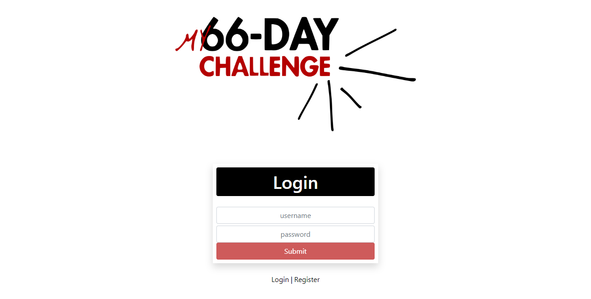

# The One Thing Challenge

Visit @ [The One Thing Challenge](http://the-one-thing-challenge.54.218.142.71.xip.io)

## Test Login:

username: testuser
password: testpassword

## Summary:

The One Thing Challenge app is a simple habit tracker application. The idea came directly from a book co-authored by Gary Keller titled: The One Thing.

## Application Details:

**Login | Register View**

This view starts the user as logged out with the option to login as the default. If the user does not have an account, they can toggle between "login" and "register" via the links below the login form. Simple client-side input data validation is implemented, and any database errors resulting from invalid account requests are displayed as an error message.

**Home View**

This view displays a header section with the user's username, and a logout link. Below this is displayed app's banner. Once this component is mounted, the app will check if the user has a habit setup. If this is the case, then the information in regards to tracking the habit will be shown, otherwise, the user will be given the opportunity to set up a new habit to track.

**Habit Setup Section**

This section allows the user to choose a category to place the habit under. The categories are derived from a default list supplied by the app. The user can also choose a start date that's either the current day or later up to the last day of the following year. Lastly, the user can enter in a description for the habit.

**Countdown Section**

This section displays the number of days left until the start date if the current day is before it.

**Habit Information Section**

This section displays a summary including the category, start date, and habit description that the user has setup. This section is also where the user can reset their tracker thereby deleting all current tracker information.

**Current Day Section**

This section displays the current day in relationship to the sixty six day tracker. For example, if the user is five days into tracking the current habit this section would display the number five. Clicking on this section will also change what day is displayed in the habit card section to this day.

**Days Overview Section**

This section displays an overview of all sixty six days being tracked. Each day's background color has meaning and follows this pattern: black = default, green = complete, red = incomplete. Likewise, the color of the displayed number has meaning and follows this pattern: white = no note, yellow = has a note. If any day is clicked on, the habit card section will show the information for that day.

**Habit Card Section**

This section displays the current day selected, allows the user to add, edit, or delete a note, and allows the user to select whether or not they completed the habit for that day.

**Notes:**
- Design was implemented using Bootstrap classes. The Bootstrap custom form validation was also used.

## Client-Side Technologies:

**Languages**

- CSS
- HTML
- JavaScript

**Libraries**

- React
- ReactDOM
- React Router DOM
- JQuery
- Popper.js
- Bootstrap
- Moment.js
- Classnames
- UUID
- Redux
- Redux-Thunk

**Linters**

- ESLint

**Build Tools**

- Babel
- Webpack

## Server-Side Technologies:

**Languages**

- Python

**Libraries**

- Flask
- Flask-SQLAlchemy
- Pipenv

**Database**

- SQLite

**Hosting**

- Amazon Web Services: Lightsail
- Ubuntu Server
- Apache HTTP Server
